# Тестовое задание для отбора на Летнюю ИТ-школу КРОК по разработке

## Условие задания
Один развивающийся и перспективный маркетплейс активно растет в настоящее время. Текущая команда разработки вовсю занята тем, что развивает ядро системы. Помимо этого, перед CTO маркетплейса стоит задача — разработать подсистему аналитики, которая на основе накопленных данных формировала бы разнообразные отчеты и статистику.

Вы — компания подрядчик, с которой маркетплейс заключил рамочный договор на выполнение работ по разработке этой подсистемы. В рамках первого этапа вы условились провести работы по прототипированию и определению целевого технологического стека и общих подходов к разработке.

На одном из совещаний с Заказчиком вы определили задачу, на которой будете выполнять работы по прототипированию. В качестве такой задачи была выбрана разработка отчета о наиболее популярных категориях товаров, продаваемых во время подготовки новогодних подарков покупателями.

Аналитики со стороны маркетплейса предоставили небольшой срез массива данных (файл format.json) о совершенных покупках пользователей за 4-й квартал 2023 года, на примере которого вы смогли бы ознакомиться с форматом входных данных. Каждая запись данного среза содержит следующую информацию:
- Дата и время оформления заказа;
- Корзина.

В пояснительной записке к массиву данных была уточняющая информация относительно формате данных, представленных в корзине. Так, например, корзина - это массив однотипных сведений о купленных товаров, определяемых следующим набором данных:
- Идентификатор товара;
- Наименование товара;
- Категория.

В свою очередь сведения о категории представлены в следующем виде:
- Идентификатор категории;
- Наименование категории.

Необходимо разработать отчет, определяющий категории товаров, наиболее популярные перед Новым годом. Если популярных категорий товаров больше, чем одна, отчет должен показывать их все. Предновогодним периодом будем считать срок с 1 по 31 декабря.

Требования к реализации:
1. Реализация должна содержать, как минимум, одну процедуру (функцию/метод), отвечающую за формирование отчета, и должна быть описана в readme.md в соответствии с чек-листом;
2. В качестве входных данных программа использует json-файл (input.json), соответствующий структуре, описанной в условиях задания;
3. Процедура (функция/метод) формирования отчета должна возвращать строку в формате json следующего формата:
   - {«categories»: [«Бытовая техника»]}
   - {«categories»: [«Бытовая техника», «Косметика»]}
4. Найденная в соответствии с условием задачи категория должна выводиться в изначальном наименовании, приведенном в файле с входными данными. Если таких категорий несколько, то на вывод они все подаются в алфавитном порядке.

## Автор решения

Благов Роман, [@ebobola-dev](https://github.com/ebobola-dev) on GitHub

## Описание реализации
Программу я решил реализовать на языке Python, ~~на большее я не способен~~ мне нравится этот язык своей простотой, набором втроенных утилит и функций для обработки данных

Все объекты данных (Категория, Товар, Заказ) я разбил на классы, так как с классами работать удобнее и они обрабатываются быстрее, нежели список из словарей, сделал минимальные проверки

При написании кода везде старался использовать tuple вместо обычных списков(list), так как нам не нужно изменять исходные списки 
*Tuple (Кортеж) в Python - тоже что и список, но неизменяем, имеет фиксированный размер, благодаря этому он немного быстрее

#### Структура проекта
- /models - модели объектов данных (классы)
- /utils - утилиты
- config - константые переменные для программы
- main - основная программа
- functions - основые функции для работы со списком заказов

#### Описание работы программы и функций
- Первым делом нужно получить список с заказами, получаем его из исходного файла файла "format.json", c помощью модуля json вытаскиваем из него словарь(dict) со списком заказов
- ~~Десериализацуем~~ Переводим список заказов в виде словаря с набором таких же словарей в список с объектами 
	Функции перевода словарей в классы:
	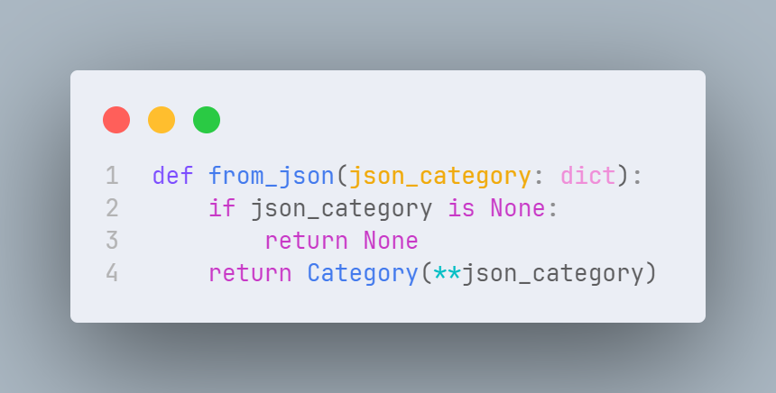
	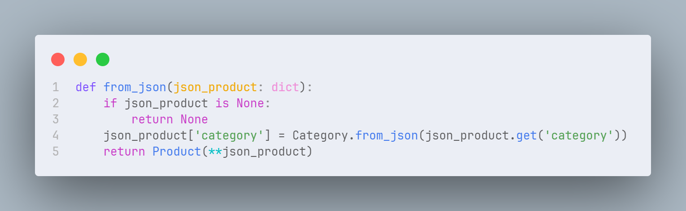
	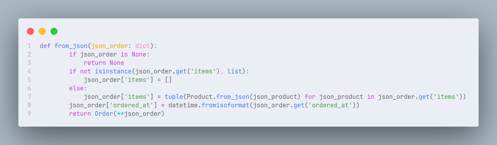

- Далее нам нужно из списка заказов выбрать только заказы в канун нового года (в декабре), я это реализовать при помощи фильтра (оставил только заказы, у которых месяц == 12)
	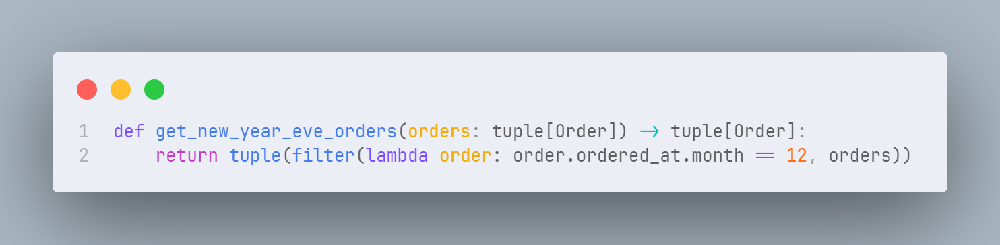
- Теперь нам нужно получить статистику категорий этих заказов (сколько раз заказывали товар каждой категории), как я это реализовал:
	- Создаю пустой словарь, прохожусь по каждому товару каждого заказа
	- Если категория новая(ещё нет в словаре), добавляю её в словарь и ставлю ей значение 1
	- Если категория уже в словаре, увеличиваю её значение на 1
	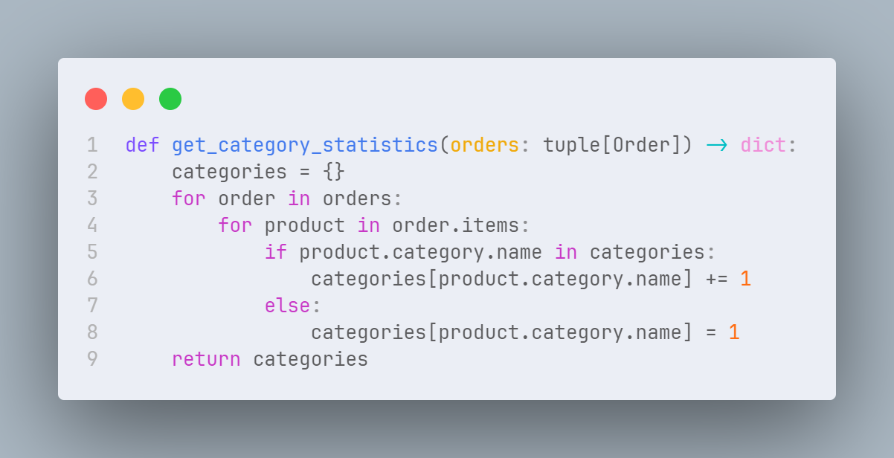 
	На выходе получаем словарь вида:
	{
		"Категория 1": 4,
		"Категория 2": 2,
		"Категория 3": 7
		...
	}
- И наконец теперь мы можем получить из этой статистики самые популярные категории 
	В задании написано - *"если популярных категорий товаров больше, чем одна, отчет должен показывать их все"*, я это понял так, что мы должны показать одну категорию, с самым большим количеством заказов, или несколько, если самые популярые категории заказали одно и то же количество раз
	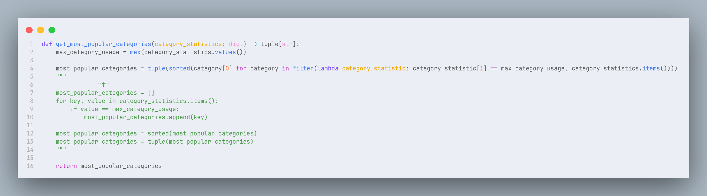 
	Я реализовал это одним длинным отсортированным фильтром, под ним оставил закомментированный цикл, который делает то же самое, но выглядит понятнее 
	Что я делаю:
	- Ищу максимальное количество заказов у категорий
	- Оставляю только категории с таким количеством заказов
	- Из словаря статистики, оставляю только ключи (наименование категорий)
	- Сортирую полученное в алфавитном порядке

	На выходе получаю список из самых популярных категорий, записываю его в файл "result.json"

#### Выполнение работы программы и результат

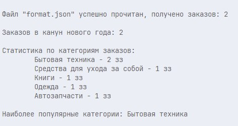
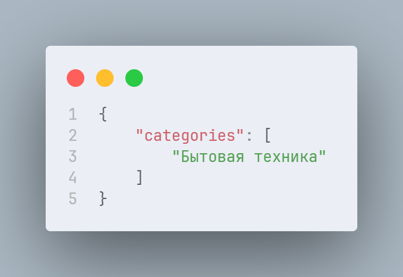

Если что-то изменить в исходной файле (поменял название одной категории):
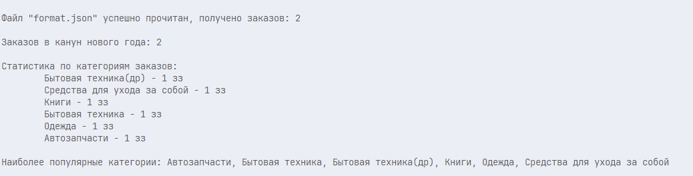
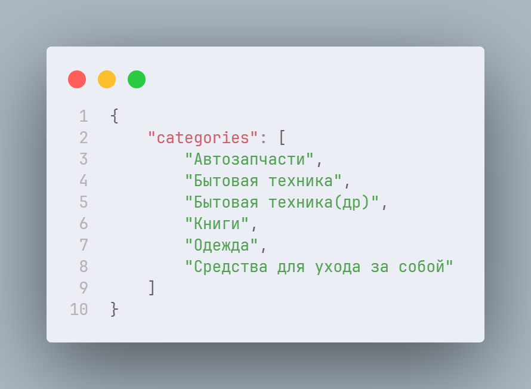

Поменял дату одного заказа(теперь он не в декабре):
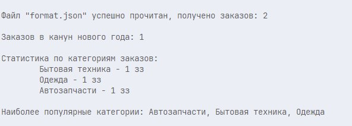
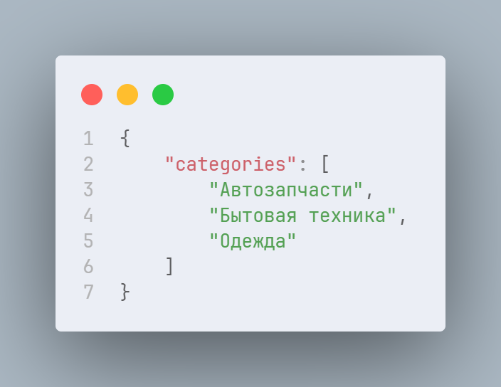

## Инструкция по сборке и запуску решения
Чтобы запустить программу не потребуется ничего кроме установленного Python, я использовал Python версии 3.12.3, никакие сторонние библиотеки и модули я не использовал